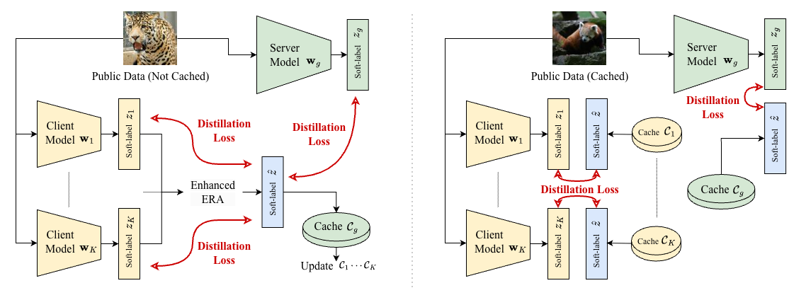

# SCARLET
[](https://github.com/astral-sh/uv)


[](https://doi.org/10.1109/TMC.2026.3652819)
[](https://arxiv.org/abs/2504.19602)


Official implementation of SCARLET: "[Soft-Label Caching and Sharpening for Communication-Efficient Federated Distillation](https://ieeexplore.ieee.org/document/11344746)" (Accepted by IEEE TMC).

<p align="center">
  
</p>

> [!IMPORTANT]
> The `main` branch contains a simplified implementation for better understanding of SCARLET’s core algorithms.
> For the exact experiment code and hyperparameter settings used in our paper, switch to the [`reproducibility`](https://github.com/kitsuyaazuma/SCARLET/tree/reproducibility) branch.

# Getting Started

## uv

```bash
git clone https://github.com/kitsuyaazuma/SCARLET.git
cd SCARLET
uv sync

uv run python -m scarlet.main scarlet
```

## Docker

```bash
docker run -it --rm --gpus=all --name scarlet ghcr.io/kitsuyaazuma/scarlet:main scarlet

# or

git clone https://github.com/kitsuyaazuma/SCARLET.git
cd SCARLET
docker build -t scarlet .
docker run -it --rm --gpus=all --name scarlet scarlet:latest scarlet
```

# Configuration

All hyperparameters are managed with [Tyro](https://github.com/brentyi/tyro). You can see all available options by running:

```bash
uv run python -m scarlet.main --help
```

# Citation

If you use this code in your research, please cite our preprint:

```bibtex
@ARTICLE{11344746,
  author={Azuma, Kitsuya and Nishio, Takayuki and Kitagawa, Yuichi and Nakano, Wakako and Tanimura, Takahito},
  journal={IEEE Transactions on Mobile Computing}, 
  title={Soft-Label Caching and Sharpening for Communication-Efficient Federated Distillation}, 
  year={2026},
  volume={},
  number={},
  pages={1-18},
  keywords={Servers;Computational modeling;Data models;Mobile computing;Entropy;Data privacy;Accuracy;Training;Quantization (signal);Federated learning;Federated learning;knowledge distillation;non-IID data;communication efficiency},
  doi={10.1109/TMC.2026.3652819}}
```
